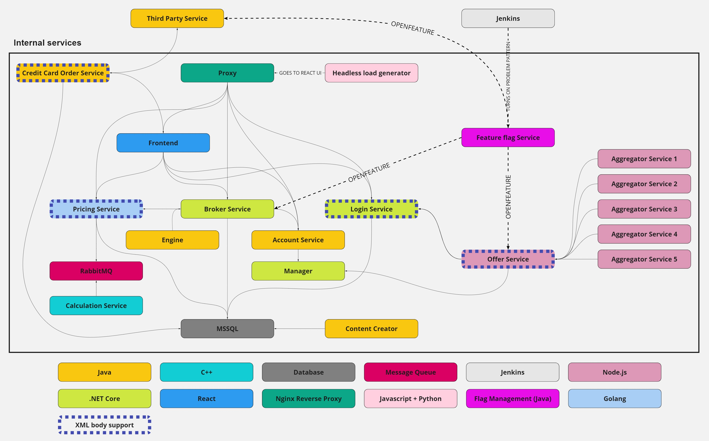

# EasyTrade

A project consisting of many small services that connect to each other.  
It is made like a stock broking application - it allows it's users to buy&sell some stocks/instruments.  
Of course it is all fake data and the price has a 24 hour cycle...

## Architecture diagram



## Database diagram


## Service list

EasyTrade consists of the following services/components:

| Service                                                              | Proxy port | Proxy endpoint               |
| -------------------------------------------------------------------- | ---------- | ---------------------------- |
| [Account service](src/accountservice/README.md)                      | 80         | `/accountservice`            |
| [Aggregator service](src/aggregator-service/README.md)               | 80         | `---`                        |
| [Broker service](src/broker-service/README.md)                       | 80         | `/broker-service`            |
| [Calculation service](src/calculationservice/README.md)              | 80         | `---`                        |
| [Content creator](src/contentcreator/README.md)                      | 80         | `---`                        |
| [Credit card order service](src/credit-card-order-service/README.md) | 80         | `/credit-card-order-service` |
| [Db](src/db/README.md)                                               | 80         | `---`                        |
| [Engine](src/engine/README.md)                                       | 80         | `/engine`                    |
| [Feature flag service](src/feature-flag-service/README.md)           | 80         | `/feature-flag-service`      |
| [Frontend](src/frontend/README.md)                                   | 80         | `/`                          |
| [Frontend reverse-proxy](src/frontendreverseproxy/README.md)         | 80         | `---`                        |
| [Loadgen](src/loadgen/README.md)                                     | --         | `---`                        |
| [Login service](src/loginservice/README.md)                          | 80         | `/loginservice`              |
| [Manager](src/manager/easyTradeManager/README.md)                    | 80         | `/manager`                   |
| [Offer service](src/offerservice/README.md)                          | 80         | `/offerservice`              |
| [Pricing service](src/pricing-service/README.md)                     | 80         | `/pricing-service`           |
| [Problem operator](src/problem-operator/README.md)                   | 80         | `---`                        |
| [RabbitMQ](src/rabbitmq/README.md)                                   | 80         | `---`                        |
| [Third party service](src/third-party-service/README.md)             | 80         | `/third-party-service`       |

> To learn more about endpoints / swagger for the services go to their respective readmes

## Docker compose

To run the easytrade using docker you can use provided `compose.yaml`.
To use it you need to have:

- Docker with minimal version **v20.10.13**
  - you can follow [this](https://docs.docker.com/engine/install/ubuntu/) guide to update Docker
  - this guide also covers installing Docker Compose Plugin
- Docker Compose Plugin
  ```bash
  sudo apt update
  sudo apt install docker-compose-plugin
  ```
  - more information in [this](https://docs.docker.com/compose/install/linux/) guide

With this you can run

```bash
docker compose up
# or to run in the background
docker compose up -d
```

You should be able to access the app at `localhost:80` or simply `localhost`.

> **NOTE:** It make take a few minutes for the app to stabilize, you may experience errors in the frontend or see missing data before that happens.

> **NOTE:** Docker Compose V1 which came as a separate binary (`docker-compose`) will not work with this version. You can check this [guide](https://www.howtogeek.com/devops/how-to-upgrade-to-docker-compose-v2/) on how to upgrade.

## Kubernetes instructions

To deploy Easytrade in kubernetes you need to have:

- `kubectl` tool installed
  - here's a [guide](https://kubernetes.io/docs/tasks/tools/install-kubectl-linux/) on how to get it
- `kubeconfig` to access the cluster you want to deploy it on
  - more info on it [here](https://kubernetes.io/docs/concepts/configuration/organize-cluster-access-kubeconfig/)

```bash
# first create the namespace for it
kubectl create namespace easytrade

# then use the manifests to deploy
kubectl -n easytrade apply -f ./kubernetes-manifests

# Optional: if you want the problem patterns to be automatically
# enabled once a day, deploy these manifests too
kubectl -n easytrade apply -f ./kubernetes-manifests/problem-patterns

# to get the ip of reverse proxy
# look for EXTERNAL-IP of frontendreverseproxy
# it may take some time before it gets assigned
kubectl -n easytrade get svc

# to delete the deployment
kubectl delete namespace easytrade
```

## Where to start

After starting easyTrade application you can:

- go to the frontend and try it out. Just go to the machines IP address, or "localhost" and you should see the login page. You can either create a new user, or use one of superusers (with easy passwords) like "demouser/demopass" or "specialuser/specialpass". Remember that in order to buy stocks you need money, so visit the deposit page first.
- go to some services swagger endpoint - you will find proper instructions in the dedicated service readmes.
- after some time go to dynatrace to configure your application and see what is going on in easyTrade - to have it work you will need an agent on the machine where you started easyTrade :P

## EasyTrade users

If you want to use easyTrade, then you will need a user. You can either:

- use the existing user - he has some preinserted data and new data is being generated from time to time:

  - login: james_norton
  - pass: pass_james_123

- create a new user - click on "Sign up" on the login page and create a new user.

> **NOTE:** After creating a new user there is no confirmation given, no email sent and you are not redirected... Just go back to login page and try to login. It should work :)

## Problem patterns

Currently there are 4 problem patterns supported in easyTrade:

1. DbNotResponding - after turning it on no new trades can be created as the database will throw an error. This problem pattern is kind of proof on concept that problem patterns work. Running it for around 20 minutes should generate a problem in dynatrace.

2. ErgoAggregatorSlowdown - after turning it on 2 of the aggregators will start receiving slower responses which will make them stop sending requests after some time. A potential run could take:

   - 15 min - then we will notice a small slowdown (for 150 seconds) followed by 40% lower traffic for 15 minutes on some requests
   - 20 min - then we will notice a small slowdown (for 150 seconds) followed by 40% lower traffic for 30 minutes on some requests

3. FactoryCrisis - when enabled, the factory won't produce new cards, which will cause the Third party service not to process credit card orders. This will block the Credit Card Order service.

4. HighCpuUsage - this problem pattern causes a slowdown of broker-service response time and highly increases CPU usage during that time. If the app is deployed on K8s, a CPU resource limit is also applied by the problem operator. This should generate CPU throttling on the pod.

To turn a plugin on/off send a request similar to the following:

```sh
curl -X PUT "http://{IP_ADDRESS}/feature-flag-service/v1/flags/{FEATURE_ID}/" \
-H  "accept: application/json" \
-d '{"enabled": {VALUE}}'
```

You can also manage enabled problem patterns via the easyTrade frontend.

> **NOTE:** More information on the feature flag service's parameters available in [feature flag service's doc](./docs/featureflagservice.md).

If you are deploying easyTrade on K8s, you can also apply [these cronjobs](./kubernetes-manifests/problem-patterns/), which will enable the problem patterns once a day.

## EasyTrade on Dynatrace - how to configure

All Dynatrace configuration required for Easytrade should be applied using [Monaco](https://github.com/Dynatrace/dynatrace-configuration-as-code). More information on how to deploy it can be found in the [`monaco` directory](./monaco).

### Business events in Dynatrace

EasyTrade application has been developed in order to showcase business events. Usually business events can be created in two ways:

- directly - using one of Dynatrace SDKs in the code - so for example in Javascript or Java
- indirectly - configure catch rules for request that are monitored by Dynatrace

If you want to learn more about business events then we suggest looking at the information on our website: [Business event capture](https://www.dynatrace.com/support/help/platform-modules/business-analytics/ba-events-capturing). There you will find information on how to create events directly (with OpenKit, Javascript, Android and more) and indirectly with capture rules in Dynatrace.

For those interested in creating capturing rules for easyTrade we suggest to have a look at the configuration exported with Monaco in this repository. Have a look at the [README](./monaco/README.md)

## Body types

EasyTrade network traffic is handled by REST requests using mostly JSON payloads. However, some of the services
can also handle XML requests. Data types are negotiated based on `Accept` and `Content-Type` headers.

#### XML compatible services

| Service                                                       | Accepted XML MIME types                            |
| ------------------------------------------------------------- | -------------------------------------------------- |
| [LoginService](./docs/loginservice.md)                        | `application/xml`; `text/xml`; `application/*+xml` |
| [CreditCardOrderService](./docs/credit-card-order-service.md) | `application/xml`                                  |
| [OfferService](./docs/offerservice.md)                        | `application/xml`; `text/xml`                      |
| [PricingService](./docs/pricing-service.md)                   | `application/xml`                                  |
