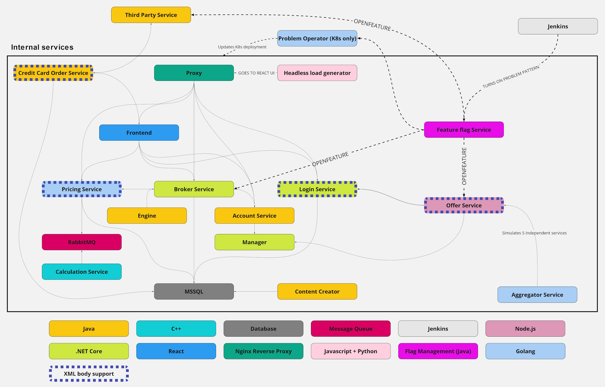

# Easytrade

A project consisting of many small services that connect to each other.  
It is made like a stock broking application - it allows it's users to buy&sell some stocks/instruments.  
Of course it is all fake data and the price has a 24 hour cycle...

## Architecture diagram



## Database diagram


## Service list

EasyTrade consists of the following services/components:

| Service                                                  | Proxy endpoint    |
| -------------------------------------------------------- | ----------------- |
| [Account service](./docs/accountservice.md)              | `/accountservice` |
| [Aggregator service](./docs/aggregatorservice.md)        | `---`             |
| [Broker service](./docs/brokerservice.md)                | `/broker`         |
| [Calculation service](./docs/calculationservice.md)      | `---`             |
| [Content creator](./docs/contentcreator.md)              | `---`             |
| [Db](./docs/db.md)                                       | `---`             |
| [Engine](./docs/engine.md)                               | `/engine`         |
| [Frontend](./docs/frontend.md)                           | `/`               |
| [Frontend reverse-proxy](./docs/frontendreverseproxy.md) | `---`             |
| [Login service](./docs/loginservice.md)                  | `/login`          |
| [Manager](./docs/manager.md)                             | `---`             |
| [Offer service](./docs/offerservice.md)                  | `/offerservice`   |
| [Plugin service](./docs/pluginservice.md)                | `/pluginservice`  |
| [Pricing service](./docs/pricingservice.md)              | `/pricing`        |

> To learn more about endpoints / swagger for the services go to their respective readmes

## Docker compose

To run the easytrade using docker you can use provided `compose.yaml`.
To use it you need to have:

- Docker with minimal version **v20.10.13**
  - you can follow [this](https://docs.docker.com/engine/install/ubuntu/) guide to update Docker
  - this guide also covers installing Docker Compose Plugin
- Docker Compose Plugin
  ```bash
  sudo apt update
  sudo apt install docker-compose-plugin
  ```
  - more information in [this](https://docs.docker.com/compose/install/linux/) guide

With this you can run

```bash
docker compose up
# or to run in the background
docker compose up -d
```

You should be able to access the app at `localhost:80` or simply `localhost`.

> **NOTE:** It make take a few minutes for the app to stabilize, you may expirience errors in the frontend or see missing data before that happens.

> **NOTE:** Docker Compose V1 which came as a separate binary (`docker-compose`) will not work with this version. You can check this [guide](https://www.howtogeek.com/devops/how-to-upgrade-to-docker-compose-v2/) on how to upgrade.

## Kubernetes instructions

To deploy Easytrade in kubernetes you need to have:

- `kubectl` tool installed
  - here's a [guide](https://kubernetes.io/docs/tasks/tools/install-kubectl-linux/) on how to get it
- `kubeconfig` to access the cluser you want to deploy it on
  - more info on it [here](https://kubernetes.io/docs/concepts/configuration/organize-cluster-access-kubeconfig/)

```bash
# first create the namespace for it
kubectl create namespace easytrade

# then use the manifests to deploy
kubectl -n easytrade apply -f ./kubernetes-manifests

# to get the ip of reverse proxy
# look for EXTERNAL-IP of frontendreverseproxy
# it may take some time before it gets assigned
kubectl -n easytrade get svc

# to delete the deployment
kubectl delete namespace easytrade
```

## Where to start

After starting easyTrade application you can:

- go to the frontend and try it out. Just go to the machines IP address, or "localhost" and you should see the login page. You can either create a new user, or use one of superusers (with easy passwords) like "demouser/demopass" or "specialuser/specialpass". Remember that in order to buy stocks you need money, so visit the deposit page first.
- go to some services swagger endpoint - you will find proper instructions in the dedicated service readmes.
- after some time go to dynatrace to configure your application and see what is going on in easyTrade - to have it work you will need an agent on the machine where you started easyTrade :P
