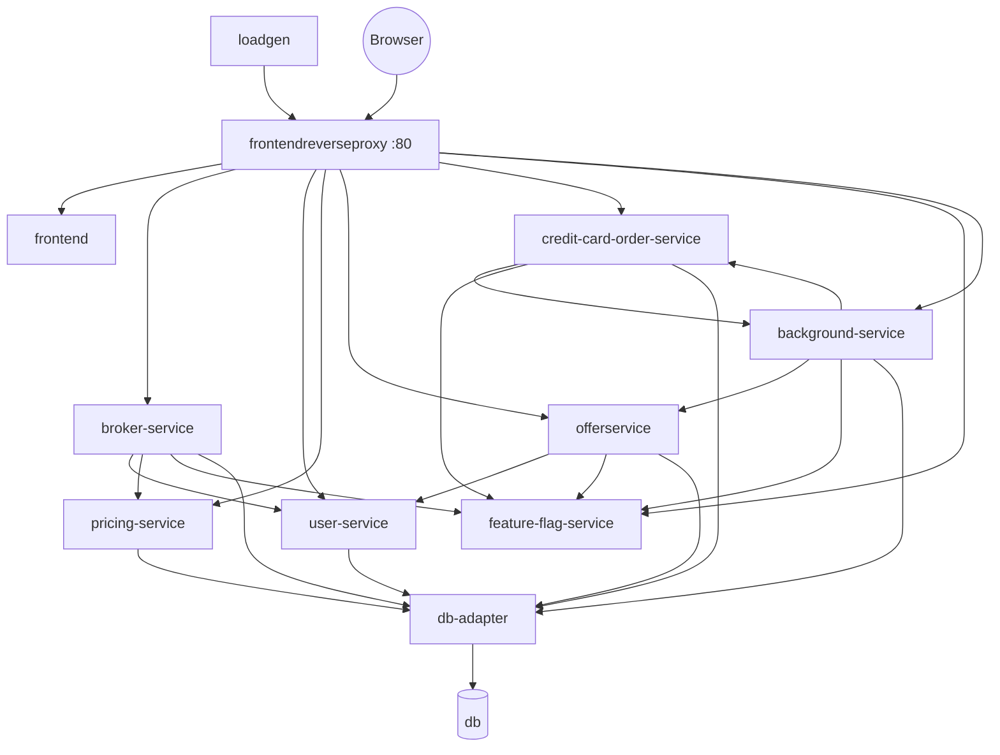
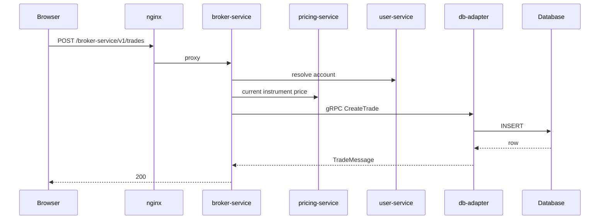

# Architecture

> **Audience:** Engineers orienting themselves in the codebase, and anyone explaining
> EasyTrade's shape to an audience.

## Shape

Everything the browser sees arrives through one nginx reverse proxy on port 80. Behind
it sit the API services, and behind *those* sits a single gRPC adapter over the
database. Traffic is generated from two directions at once: `loadgen` drives the public
UI like a real user, and `background-service` simulates external systems calling the
APIs directly.

The README carries a machine-generated version of this graph, produced from
`compose.dev.yaml` by `make update-graph`. Regenerate it rather than editing it by
hand.

## Three architectural decisions worth knowing

### One database adapter, not one connection per service

`db-adapter` is the only service that opens a database connection. Every other service
reaches storage through gRPC using contracts in `src/proto/`. This keeps dialect
handling, retry, and UUID quirks in one Go codebase instead of four languages, and it
is what makes the MSSQL/Postgres swap a single environment variable.
See [Data layer](technology-stack/data-layer.md).

### Consolidation into `background-service`

Four formerly separate services — the aggregator, the content creator, the third-party
card factory, and the standalone `problem-operator` — are now one Go binary with four
subsystems. The operator subsystem is gated on `POD_NAMESPACE`, so it starts in
Kubernetes and silently does nothing under Docker Compose. That gate is deliberately
reused rather than duplicated in a purpose-built toggle, since Kubernetes injects
`POD_NAMESPACE` via the Downward API anyway.

Earlier consolidations went the same way: the `engine` service was merged into
`broker-service`, and `calculationservice`, `manager`, `contentcreator`,
`third-party-service`, and RabbitMQ were removed outright.

### Faults are injected inline, never simulated at the edge

Problem patterns live inside the services they affect — as ASP.NET middleware, an
Express middleware, a repository subclass, a background tick, or a Kubernetes reconcile
loop. Nothing sits in front of a service faking failures. That is why
[DbNotResponding](problem-patterns/db-not-responding.md) produces a real driver error on
a real SQL statement rather than a synthetic-looking one.

## Request path: buying an instrument

Long trades take a second pass: `LongTradeSchedulerService` inside `broker-service`
closes them when their duration expires.

## Background traffic

Nothing about EasyTrade is idle. Even with no user present:

| Producer | Cadence | What it produces |
|---|---|---|
| `aggregator` (5 platforms) | 3 s offers, 1 h signups | Offer queries against `offerservice`, half JSON and half XML |
| `contentcreator` | per minute | OHLC candles for 15 instruments; periodic purge of stale trades, balance history, and accounts |
| `thirdparty` | `THIRD_PARTY_RATE` (10 s) | Credit-card manufacture, shipping, and delivery transitions |
| `loadgen` | continuous, `CONCURRENCY` sessions | Puppeteer browser journeys through the real UI |

This matters for demos: a problem pattern shows up as a change in a *steady* signal,
which is far more legible than a change against silence.

## Deployment targets

| Target | Entry point | Notes |
|---|---|---|
| Docker Compose, local source | `make start` (`compose.dev.yaml`) | Per-service host ports; frontend runs the Vite dev server with `src/` bind-mounted |
| Docker Compose, registry images | `make start-remote` (`compose.yaml`) | Uses `REGISTRY` and `TAG` from `.env` |
| Kubernetes | `make k8s-install` / `k8s-install-remote` | Helm chart in `helm/easytrade`; namespace `easytrade`. Only here does the operator subsystem run |

The three compose files are not interchangeable. `compose.yaml` runs pre-built registry
images, `compose.dev.yaml` builds from local source, and `compose.build.yaml` builds and
tags images for the registry in CI. Editing the wrong one is the most common mistake in
this repository.
