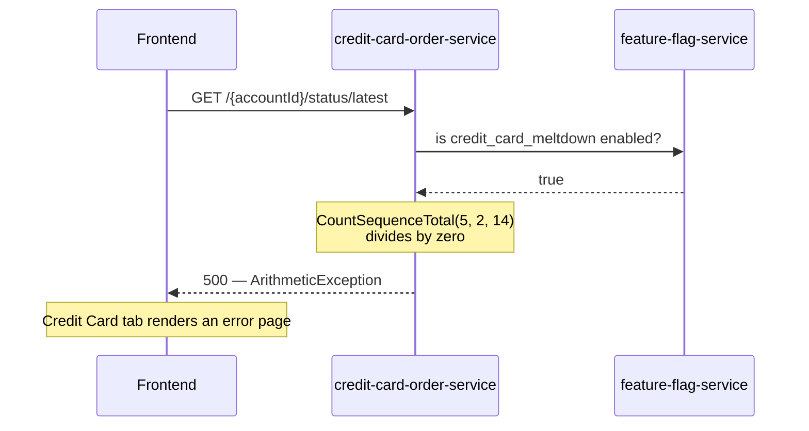

# CreditCardMeltdown

| | |
|---|---|
| Flag ID | `credit_card_meltdown` |
| Default | off (`ENABLE_CREDIT_CARD_MELTDOWN`) |
| Blast radius | `GET /{accountId}/status/latest` on `credit-card-order-service` |
| Time to visible effect | Immediate |

## What the user sees

Opening the Credit Card tab in the frontend produces an error page. The request for the
latest credit-card order status throws before it ever reaches the database, and the
exception propagates out of the controller unhandled.

This pattern produces an **unhandled application exception** rather than a slowdown or
a stalled process.

## Flow



## How it is implemented

`OrderController.getLatestStatus` checks the flag through its OpenFeature client
before doing any work:

```java
final Client client = openFeatureAPI.getClient();
if (client.getBooleanValue("credit_card_meltdown", false)) {
    CountSequenceTotal(5, 2, 14);
}
```

`CountSequenceTotal` is a plausible-looking arithmetic helper whose parameters drive it
into a division by zero. The surrounding `catch (RuntimeException e)` handler
re-throws rather than converting it to a tidy error response, so the stack trace reaches
the client.

The service also runs with `JAVA_TOOL_OPTIONS: "-XX:-OmitStackTraceInFastThrow"` in
compose, which disables the JVM optimisation that strips stack traces from repeatedly
thrown exceptions, so the full trace is kept on every hit.

## Scope

Only `/{accountId}/status/latest` is affected. Fetching the full status *history*
(`/{accountId}/status`), placing orders, and deleting orders all keep working.

## Source

- `src/credit-card-order-service/src/main/java/com/dynatrace/easytrade/creditcardorderservice/OrderController.java`
