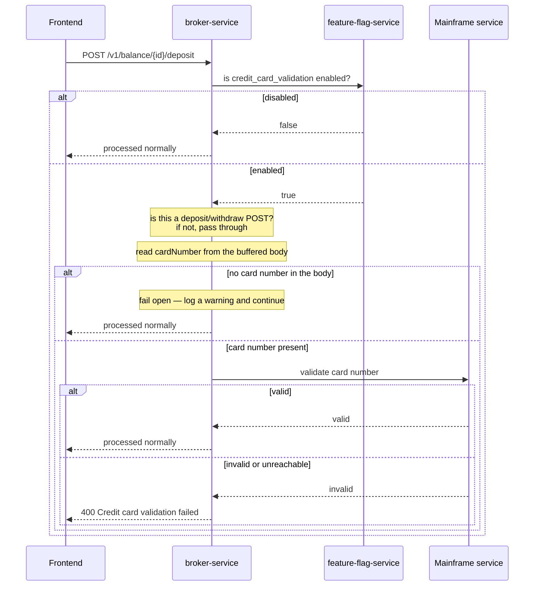

# CreditCardValidation

| | |
|---|---|
| Flag ID | `credit_card_validation` |
| Default | off (`ENABLE_CREDIT_CARD_VALIDATION`) |
| Blast radius | `POST /v1/balance/{accountId}/deposit` and `/withdraw` |
| Requires | `MAINFRAME_SERVICE_ADDRESS` configured on `broker-service` |

## What the user sees

Depositing or withdrawing money fails with HTTP 400 and
`"Credit card validation failed"`. Trading against an existing balance still works;
only money movement is blocked.

Every deposit and withdrawal is cleared by a mainframe before it is accepted, adding an
outbound dependency to the request path.

## Flow

## How it is implemented

`CreditCardValidationMiddleware` runs on every `broker-service` request but narrows
itself aggressively before doing any work. It returns early unless **all** of the
following hold:

1. the flag is enabled;
2. the request is a `POST` whose path starts with `/v1/balance/` and ends with
   `/deposit` or `/withdraw`;
3. a `cardNumber` can be read from the JSON body.

Condition 3 **fails open**: a matching request with no card number is logged as a
warning and passed through rather than rejected.

The body is read with `request.EnableBuffering()` and then rewound with
`Seek(0, SeekOrigin.Begin)`, so the downstream controller still receives an intact
request body.

## Configuration

| Variable | Service | Required | Meaning |
|---|---|---|---|
| `ENABLE_CREDIT_CARD_VALIDATION` | `feature-flag-service` | no | Initial flag value |
| `MAINFRAME_SERVICE_ADDRESS` | `broker-service` | yes, when the flag is used | Address of the validating mainframe |

`MAINFRAME_SERVICE_ADDRESS` is **not** set in `compose.dev.yaml` or `compose.yaml`.
Enabling this flag on a plain compose stack will therefore exercise the unconfigured
path rather than a real validation round trip; set the variable first.

## Source

- `src/broker-service/src/Middleware/CreditCardValidation/CreditCardValidationMiddleware.cs`
- `src/broker-service/src/Middleware/CreditCardValidation/MainframeServiceConnector.cs`
