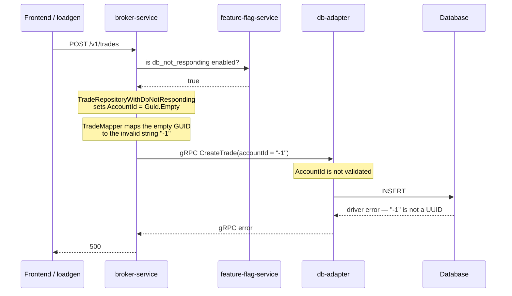

# DbNotResponding

| | |
|---|---|
| Flag ID | `db_not_responding` |
| Default | off (`ENABLE_DB_NOT_RESPONDING`) |
| Blast radius | Trade creation only |
| Time to a detected problem | ~20 minutes |

## What the user sees

New trades cannot be created. Buying or selling an instrument returns an error, while
everything else — logging in, browsing instruments, viewing existing positions, prices —
keeps working normally. The failure is a genuine database error, not a simulated one.

## Flow



## How it is implemented

`TradeRepositoryWithDbNotResponding` is a subclass of the normal `TradeRepository`,
registered in place of it. It overrides exactly one method:

```csharp
public override async Task<Trade> CreateTradeAsync(Trade trade)
{
    if (await _pluginManager.GetPluginState(Constants.DbNotResponding, false))
    {
        trade.AccountId = Guid.Empty;
    }
    return await base.CreateTradeAsync(trade);
}
```

`Guid.Empty` is a marker, not the value that reaches the database. `TradeMapper`
translates it into the literal string `"-1"` (`Constants.InvalidAccountId`) when
building the gRPC request, and `db-adapter`'s `CreateTrade` handler does **not** validate
`AccountId` — it validates `InstrumentId` only — so the bad value reaches the driver and
the database rejects it.

The insert follows the normal code path; there is no separate failure path in
`db-adapter`. Adding `AccountId` validation to `CreateTrade` would stop this pattern
working.

## Source

- `src/broker-service/src/ProblemPatterns/DbNotResponding/TradeRepositoryWithDbNotResponding.cs`
- `src/broker-service/src/Entities/Trades/Repository/TradeMapper.cs`
- `src/db-adapter/server/trade.go`
