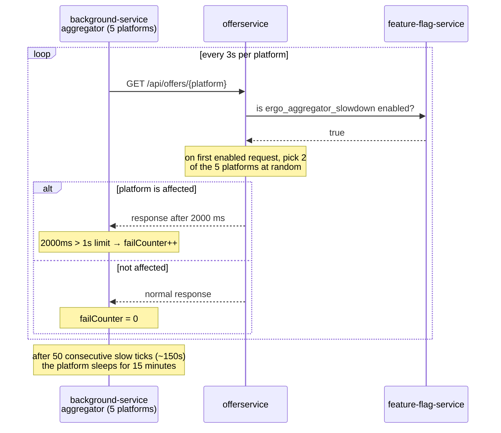

# ErgoAggregatorSlowdown

| | |
|---|---|
| Flag ID | `ergo_aggregator_slowdown` |
| Default | off (`ENABLE_ERGO_AGGREGATOR_SLOWDOWN`) |
| Blast radius | 2 of 5 simulated trading platforms |
| Time to visible effect | ~150 seconds of slowdown, then a 15-minute traffic drop |

## What the user sees

Nothing, in the browser. This pattern lives entirely in the synthetic background
traffic: a slowdown in `offerservice` causes the calling platforms to back off, which
shows up as a traffic drop rather than as errors.

## Flow

## How it is implemented

**`offerservice` side** — `slowdownMiddleware` wraps the offers endpoint. The first time
it sees the flag enabled it calls `slowdownState.activate()`, which samples **2 of the 5
platforms at random** and remembers them. Requests from an affected platform get a
`2000 ms` delay; everyone else is untouched. When the flag goes false the state is
cleared, so the next activation picks a different pair.

**`background-service` side** — each of the 5 aggregator platforms polls
`offerservice` every 3 seconds and measures the round trip. Anything at or above
`RequestTimeLimit` (1 second) counts as a failure and increments `failCounter`; a fast
response resets it to zero. At `FailLimit` (50) consecutive failures the platform
sleeps for `FailDelay` (15 minutes).

The tuning constants that produce the observed timings:

| Constant | Value | Where |
|---|---|---|
| `SLOWDOWN_DELAY_MS` | `2000` | `src/offerservice/src/config.ts` |
| `SLOWDOWN_AFFECTED_PLATFORM_COUNT` | `2` | `src/offerservice/src/config.ts` |
| `DefaultDelay` (poll interval) | `3s` | `src/background-service/aggregator/platform.go` |
| `DefaultRequestTimeLimit` | `1s` | same |
| `DefaultFailLimit` | `50` | same |
| `DefaultFailDelay` | `15m` | same |

50 ticks × 3 s ≈ **150 seconds** of visible slowdown before the back-off starts. Two of
five platforms pausing is a **40 % drop** in offer traffic for the following 15 minutes.

## Reading the timeline

Turning the flag on and leaving it on produces a repeating sawtooth: 150 s of slow
requests, 15 min of reduced traffic, then the affected platforms resume and the cycle
repeats. Turning the flag off does **not** wake a sleeping platform early — the
`time.Sleep` is already in progress, so expect up to 15 more minutes of reduced traffic
after you disable it.

## The five platforms

`dynatestsieger.at`, `tradeCom.co.uk`, `CryptoTrading.com`, `CheapTrading.mi`,
`Stratton-oakmount.com` — each with its own product filter, fee cap, and package-mix
probabilities, defined in `src/background-service/aggregator/config.go`. Half their
offer requests use JSON and half use XML, which is also what exercises
`offerservice`'s XML content negotiation.

## Source

- `src/offerservice/src/middleware/slowdown.ts`
- `src/background-service/aggregator/platform.go`, `jobs.go`, `config.go`
