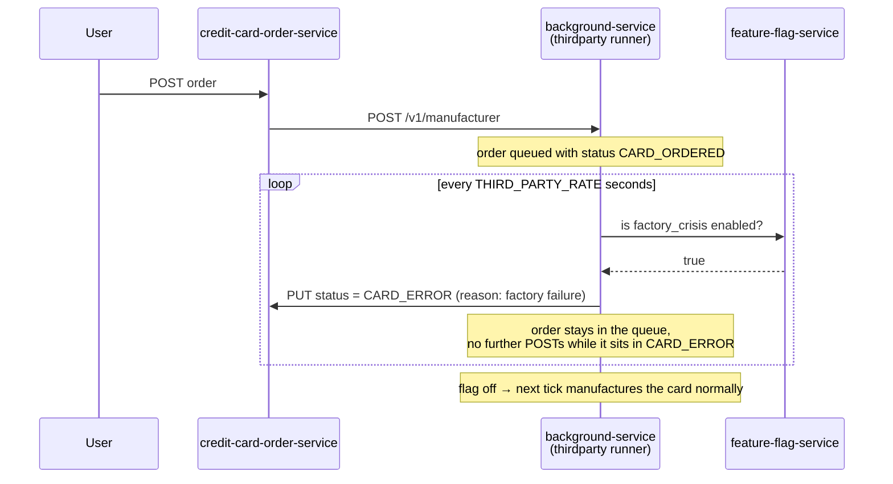

# FactoryCrisis

| | |
|---|---|
| Flag ID | `factory_crisis` |
| Default | off (`ENABLE_FACTORY_CRISIS`) |
| Blast radius | Credit-card manufacture, for every pending order |
| Time to visible effect | One `thirdparty` tick (`THIRD_PARTY_RATE`, 10 s in compose) |

## What the user sees

Credit-card orders never progress. An order placed on the Credit Card tab stays in
`CARD_ERROR` with a *factory failure* reason instead of moving on to created, shipped,
and delivered. Trading is unaffected.

Nothing returns HTTP 500 — the pipeline simply stops advancing.

## Flow



## How it is implemented

The `thirdparty` runner in `background-service` keeps pending orders in memory and walks
them on every tick. `processManufacture` checks the flag first:

```go
crisis, error := r.flags.GetBool(ctx, "factory_crisis", false)
if crisis {
    if o.Status != OrderCardError {
        r.svc.UpdateStatus(ctx, OrderCardError, o.Request.CreditCardOrderID, FactoryFailure)
        o.Status = OrderCardError
    }
    return
}
```

The `o.Status != OrderCardError` guard means each order is reported once, on the first
tick it enters `CARD_ERROR`, rather than on every tick the crisis lasts.

Orders are never dropped. They stay in the runner's slice until they reach
`CARD_DELIVERED`, so when the flag is turned off the backlog manufactures on the next
tick and drains normally.

## The normal delay simulation

Even with the flag off, `processManufacture` fails a share of orders:
`DELAY_CHANCE_PERCENT` (20 % in compose) of manufacture attempts report `CARD_ERROR`
with either a *delay on chips* or a *factory failure* reason, and retry on the next
tick. A handful of orders in `CARD_ERROR` is normal; *every* order stuck there is
FactoryCrisis.

## Relevant configuration

| Variable | Compose value | Meaning |
|---|---|---|
| `THIRD_PARTY_DELAY` | `10` | Seconds before the runner's first tick |
| `THIRD_PARTY_RATE` | `10` | Base seconds between ticks (jittered up to 2×) |
| `DELAY_CHANCE_PERCENT` | `20` | Percent chance of a simulated manufacturing delay per order per tick |

## Source

- `src/background-service/thirdparty/runner.go`
- `src/background-service/thirdparty/handlers.go` (`/v1/manufacturer`)
