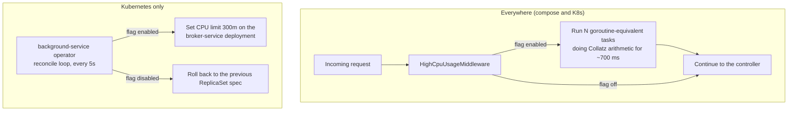

# HighCpuUsage

| | |
|---|---|
| Flag ID | `high_cpu_usage` |
| Default | off (`ENABLE_HIGH_CPU_USAGE`) |
| Blast radius | Every `broker-service` request |
| Time to visible effect | Immediate |

## What the user sees

The whole trading UI becomes sluggish. Every `broker-service` request — balances,
trades, instruments — gains roughly 700 ms, and the service's CPU usage climbs sharply
for the duration of each request.

On Kubernetes, `background-service`'s operator subsystem additionally applies a CPU
**limit** to the `broker-service` deployment, so the same workload also shows CPU
throttling on the pod.

## Flow

## How it is implemented — the CPU burn

`HighCpuUsageMiddleware` runs before every request. When the flag is on it starts
`HIGH_CPU_USAGE_CONCURRENCY` (default 4) parallel tasks that loop the Collatz sequence
over random integers until `HIGH_CPU_USAGE_REQUEST_DELAY_MS` (default 700) milliseconds
have elapsed, then lets the request through.

Both hot methods carry `[MethodImpl(MethodImplOptions.NoInlining)]`, which keeps them
visible in the captured call hierarchy instead of being inlined by the JIT.

| Variable | Default | Effect |
|---|---|---|
| `HIGH_CPU_USAGE_REQUEST_DELAY_MS` | `700` | How long each request burns CPU |
| `HIGH_CPU_USAGE_CONCURRENCY` | `4` | How many parallel burn tasks |

## How it is implemented — the Kubernetes operator

The operator subsystem lives inside `background-service` and is **gated on
`POD_NAMESPACE`**: that variable is injected by the Kubernetes Downward API and is never
set by either compose file, so outside a cluster the subsystem never starts.

Every `SYNC_INTERVAL` (default `5s`) the operator:

1. reads `high_cpu_usage` from `feature-flag-service`;
2. fetches the `broker-service` Deployment in its own namespace;
3. compares the flag against the deployment's current annotation and decides
   `ShouldApply`, `ShouldRollback`, or `Synchronized`;
4. on apply, sets the CPU limit (`HIGH_CPU_USAGE_BROKER_SERVICE_CPU_LIMIT`, default
   `300m`) and stamps the annotation; on rollback, restores the spec from the previous
   ReplicaSet.

Each transition also emits a Kubernetes Event (`FlagApply` / `FlagRollback`) against the
deployment, so `kubectl describe deployment broker-service` shows when the pattern was
applied. Conflicting updates are retried with `retry.RetryOnConflict`, and repeated
context timeouts widen the reconcile interval by 10 %.

## Source

- `src/broker-service/src/ProblemPatterns/HighCpuUsage/HighCpuUsageMiddleware.cs`
- `src/background-service/operator/` — `gate.go`, `config.go`, `operator.go`, `deployment.go`, `annotations.go`
