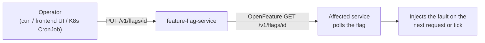

# Problem patterns — how they work

> **Audience:** Anyone preparing an EasyTrade demo, or debugging why EasyTrade is
> misbehaving on purpose.

A *problem pattern* is a deliberate, reversible fault that EasyTrade can inject into
itself. Each one is designed to surface in Dynatrace as a recognisable problem —
a failure rate spike, a slowdown, a blocked business process, CPU throttling — without
anyone having to touch the deployment.

## The mechanism

Every pattern follows the same three-step shape.



1. **`feature-flag-service`** holds every flag in memory. It is the single source of
   truth and has no database — restarting it resets every flag to its environment
   default.
2. **The affected service reads the flag itself** through an
   [OpenFeature](https://openfeature.dev/) client pointed at `feature-flag-service`.
   There is no push, no message bus, no config reload. Each service decides for itself
   how often to ask.
3. **The fault is injected inline** — in middleware, in a repository override, in a
   background tick, or in a Kubernetes reconcile loop.

Because the flag is read per request or per tick, turning a pattern off takes effect
almost immediately. The *symptom*, however, may take much longer to clear: see
[ErgoAggregatorSlowdown](ergo-aggregator-slowdown.md), where one flip costs 15 minutes
of reduced traffic.

## Where each pattern lives

| Flag ID | Injected by | Injection point | Visible as |
|---|---|---|---|
| `db_not_responding` | `broker-service` → `db-adapter` → database | `TradeRepositoryWithDbNotResponding` | Trade creation fails with a driver-level error |
| `ergo_aggregator_slowdown` | `offerservice` | `slowdownMiddleware` | Slow offer responses, then a 15-minute traffic drop |
| `factory_crisis` | `background-service` | `thirdparty` runner tick | Credit-card orders stuck in `CARD_ERROR` |
| `high_cpu_usage` | `broker-service` (+ `background-service` operator on K8s) | `HighCpuUsageMiddleware` | Response-time spike, high CPU, CPU throttling on K8s |
| `credit_card_meltdown` | `credit-card-order-service` | `OrderController.getLatestStatus` | `ArithmeticException` on the Credit Card tab |
| `credit_card_validation` | `broker-service` | `CreditCardValidationMiddleware` | Deposits/withdrawals rejected with HTTP 400 |

`frontend_feature_flag_management` also exists but is **not** a problem pattern — it
controls whether the flag UI is exposed in the frontend, and is itself non-modifiable
at runtime.

## Turning a pattern on and off

Through the API:

```bash
curl -X PUT "http://localhost/feature-flag-service/v1/flags/high_cpu_usage/" \
  -H "accept: application/json" \
  -d '{"enabled": true}'
```

Through the UI: the EasyTrade frontend exposes the same switches, provided
`frontend_feature_flag_management` is enabled.

Swagger: `http://localhost/feature-flag-service/swagger-ui/index.html`

On Kubernetes you can schedule patterns with the CronJobs shipped in the repository, so
a demo environment breaks itself once a day without anyone watching.

## Flag defaults and lockdown

Every flag's initial value comes from an environment variable on `feature-flag-service`
(`ENABLE_DB_NOT_RESPONDING`, `ENABLE_FACTORY_CRISIS`, and so on), all defaulting to
`false` except `frontend_feature_flag_management`.

Two environment variables control who may change them:

| Variable | Default | Effect |
|---|---|---|
| `ENABLE_MODIFY` | `true` | When `false`, every problem-pattern flag becomes non-modifiable and `PUT` returns an error |
| `ENABLE_FRONTEND_MODIFY` | `true` | Initial value of `frontend_feature_flag_management`; hides the flag UI when `false` |

Use `ENABLE_MODIFY=false` to hand out an environment that cannot be broken by its
audience.

## Choosing a pattern for a demo

| You want to show | Use |
|---|---|
| Failure-rate problem and root cause in the database tier | [DbNotResponding](db-not-responding.md) |
| Service slowdown propagating into reduced upstream traffic | [ErgoAggregatorSlowdown](ergo-aggregator-slowdown.md) |
| A stalled business process, best seen through business events | [FactoryCrisis](factory-crisis.md) |
| Resource saturation and Kubernetes CPU throttling | [HighCpuUsage](high-cpu-usage.md) |
| An unhandled exception reaching the end user | [CreditCardMeltdown](credit-card-meltdown.md) |
| A dependency on an external legacy system rejecting traffic | [CreditCardValidation](credit-card-validation.md) |
