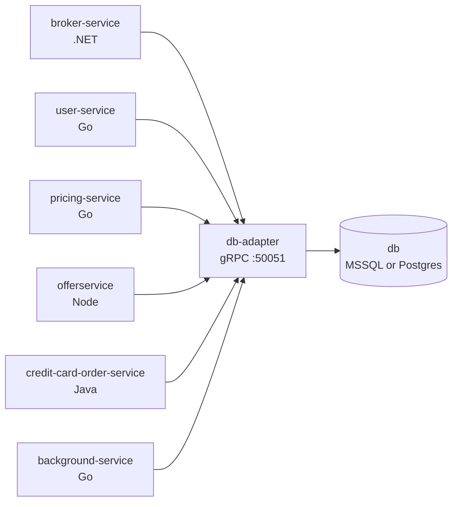

# Data layer

> **Audience:** Engineers touching persistence, adding a backend, or debugging a
> database-related failure.

Every EasyTrade service shares one logical database, and exactly one service is allowed
to open a connection to it: **`db-adapter`**. Everything else goes through gRPC.



## Why a single adapter

Four languages meant four sets of connection strings, four ORMs, and four dialect
quirks to keep in step. Routing everything through one Go service collapses that to a
single place where SQL dialect, connection retry, UUID handling, and identifier quoting
are dealt with — and gives every other service the same, stack-independent contract.

It also means the storage backend is swappable. `DB_TYPE` selects it and nothing else
in the stack notices.

## Pluggable backends

`DB_TYPE` is read by both `db-adapter` (which backend to instantiate) and
`compose.dev.yaml` (which image to build for the `db` container, from
`src/db/${DB_TYPE}/`).

| `DB_TYPE` | Port | Schema + seed | Driver |
|---|---|---|---|
| `mssql` | 1433 | `src/db/mssql/` | `gorm.io/driver/sqlserver` |
| `postgres` | 5432 | `src/db/postgres/` | `gorm.io/driver/postgres` |

Set both `DB_TYPE` and the matching `DB_URL` in `.env`:

```bash
# MSSQL
DB_TYPE=mssql
DB_URL=sqlserver://sa:PASSWORD@db:1433?database=TradeManagement&encrypt=disable

# Postgres
DB_TYPE=postgres
DB_URL=postgres://postgres:PASSWORD@db:5432/TradeManagement?sslmode=disable
```

Never commit real credentials — the values in `.env` are local development defaults.

## Layout of `db-adapter`

```
repository/
  interfaces.go     DBBackend composite interface + 8 repository interfaces
  constants.go      canonical table & column names
  errors.go         sentinel errors (ErrNotFound, …)
  sql/              one dialect-agnostic GORM backend serving MSSQL and Postgres
server/             gRPC handlers; register.go wires them up
config/             env config; DB_TYPE selects the backend
db/                 connect-with-retry helper
backend.go          newDBBackend — switches on DB_TYPE (the extension point)
main.go             builds the backend, starts the gRPC server
```

The server layer depends only on `repository` interfaces, so adding a GORM-supported
dialect means adding a constructor in `repository/sql/backend.go` and a `case` in
`newDBBackend`. Nothing in `server/` changes.

## Dialect gotchas worth knowing

**Identifier quoting.** `q()` / `qcol()` in `repository/sql/helpers.go` wrap PascalCase
identifiers in double quotes. Both dialects accept that, and it is required on Postgres,
which folds unquoted identifiers to lower case.

**UUID round-trip on MSSQL.** The provider injects `guid conversion=true` into the DSN
so `go-mssqldb` reorders mixed-endian bytes before handing off to `*uuid.UUID`. Without
it, every GUID comes back scrambled.

## The gRPC contracts

Shared `.proto` files live in `src/proto/` and are the single source of truth for both
sides of every call:

```
account_service.proto            balance_service.proto
common.proto                     credit_card_order_service.proto
instrument_service.proto         package_service.proto
pricing_service.proto            product_service.proto
trade_service.proto
```

Stubs are generated at Docker build time rather than committed, per stack:

| Stack | How |
|---|---|
| Go | `generate-proto.sh` in each service directory; `make generate-proto` runs them all |
| .NET | `Grpc.Tools` MSBuild integration |
| Java | `com.google.protobuf` Gradle plugin |
| Node | `npm run generate:proto` (`@bufbuild/protobuf` + `@grpc/grpc-js`) |

Re-run the generator for every affected service whenever a `.proto` file changes.
See `src/proto/ADAPTER_SERVICES.md` for the per-service contract breakdown.

## Validation is asymmetric on purpose

`db-adapter` validates UUID-shaped fields on most requests, but `CreateTrade`
validates `InstrumentId` only — not `AccountId`. That gap is load-bearing: it is what
lets the [DbNotResponding](../problem-patterns/db-not-responding.md) pattern push an
invalid account ID all the way to the driver and produce a genuine database error.
