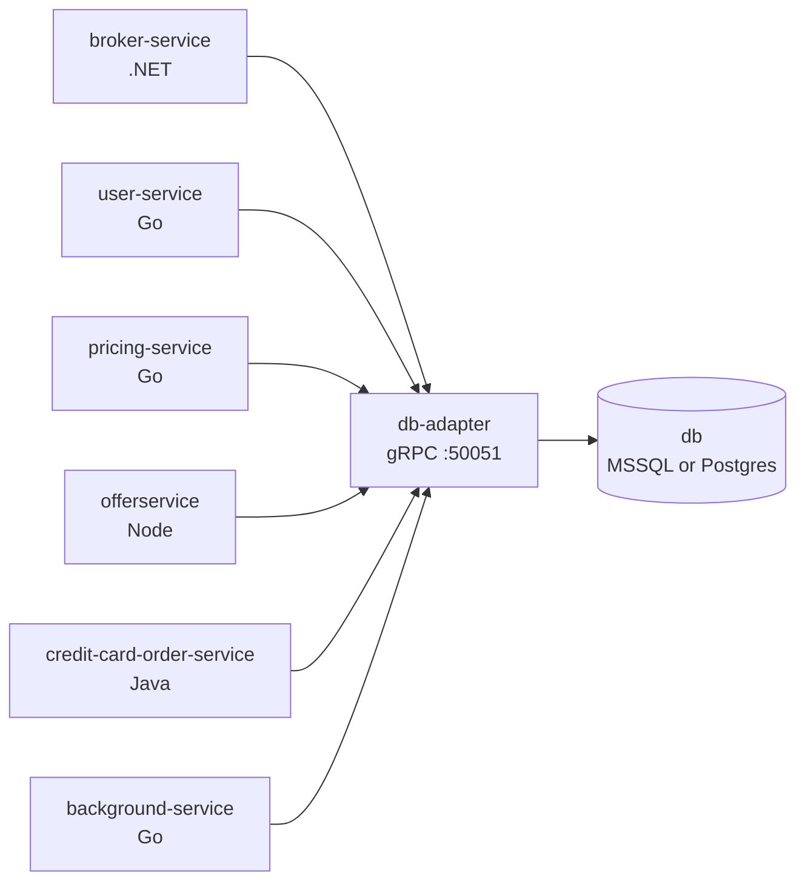

# Data layer

Every EasyTrade service shares one logical database, and exactly one service is allowed
to open a connection to it: **`db-adapter`**. Everything else goes through gRPC.

## What the adapter owns

SQL dialect, connection retry, UUID handling, and identifier quoting all live in this
one Go service. Every other service gets the same stack-independent gRPC contract
regardless of which backend is running.

## Pluggable backends

`DB_TYPE` selects which backend `db-adapter` instantiates. Two ship today:

| `DB_TYPE` | Port | Schema + seed |
|---|---|---|
| `postgres` | 5432 | `src/db/postgres/` |
| `mssql` | 1433 | `src/db/mssql/` |

Any other database that GORM has a driver for can be added without touching any other
service — the rest of the stack only ever sees the gRPC contract.
