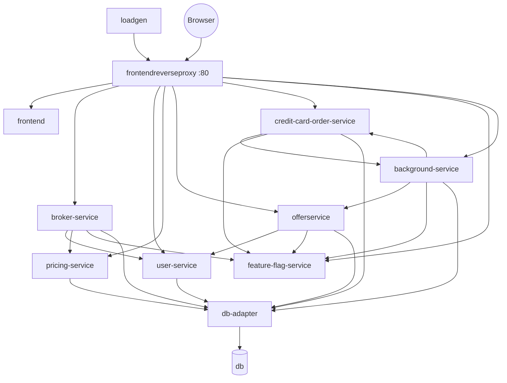

# Service reference

Twelve directories under `src/`. Four language stacks run in a single deployment.

Every service listens on `8080` internally and exposes `/livez` (liveness) and `/readyz`
(readiness). `compose.dev.yaml` publishes each on a distinct host port so you can bypass
nginx during development.

| Service                     | Language    | Framework / key libraries                              | Proxy path                   | Dev port           |
| --------------------------- | ----------- | ------------------------------------------------------ | ---------------------------- | ------------------ |
| `frontendreverseproxy`      | —           | nginx                                                  | —                            | 80                 |
| `frontend`                  | TypeScript  | **React 18**, Vite 6, React Router 7, TanStack Query 5 | `/`                          | 8092               |
| `broker-service`            | C# / .NET 8 | **ASP.NET Core**, Grpc.Net.Client, OpenFeature         | `/broker-service`            | 8084               |
| `user-service`              | Go          | **Gin**, gRPC client                                   | `/user-service`              | 8089               |
| `pricing-service`           | Go          | **Gin**, gRPC client                                   | `/pricing-service`           | 8083               |
| `offerservice`              | TypeScript  | **Express 5**, `@grpc/grpc-js`, OpenFeature, Winston   | `/offerservice`              | 8087               |
| `credit-card-order-service` | Java 21     | **Spring Boot 4**, Gradle, gRPC client                 | `/credit-card-order-service` | 8091               |
| `feature-flag-service`      | Go          | **Gin**                                                | `/feature-flag-service`      | 8094               |
| `background-service`        | Go          | zap, OpenFeature, `client-go`                          | `/background-service`        | 8095               |
| `db-adapter`                | Go          | **GORM**, gRPC server                                  | —                            | 50051 (gRPC), 8096 |
| `db`                        | —           | Postgres or MSSQL                                      | —                            | 5432 / 1433        |
| `loadgen`                   | TypeScript  | **Puppeteer** via `@demoability/loadgen-core`, Winston | —                            | 8097               |

## What each service does

### `frontendreverseproxy` — nginx

A `location` block per service prefix, plus `location /` for the frontend. Everything
the browser touches goes through port 80, so EasyTrade presents a single origin.

### `frontend` — React 18 + Vite

The trading UI: login, instruments, prices, positions, deposits, credit cards, and the
problem-pattern switches. Charts are drawn with `lightweight-charts`; server state is
cached with TanStack Query; routing is React Router 7. Tested with Vitest and Testing
Library under jsdom. In dev it runs the Vite dev server with `src/` bind-mounted, so
edits are live.

### `broker-service` — ASP.NET Core

The core trading engine, and the biggest service: trades, balances, instruments, and
portfolio history. Persistence is **gRPC to `db-adapter`** — no ORM, no database
connection of its own. Runs `LongTradeSchedulerService`, which closes long trades when
they expire.

Hosts three of the injected faults:
[HighCpuUsage](../problem-patterns/high-cpu-usage.md),
[DbNotResponding](../problem-patterns/db-not-responding.md), and the
[CreditCardValidation](../problem-patterns/credit-card-validation.md) middleware.
Depends on `user-service`, `pricing-service`, `feature-flag-service`, and `db-adapter`.
The only service with a test project (xUnit).

### `user-service` — Go + Gin

Authentication and account management. All data access goes through `db-adapter` via the
generated `AccountServiceClient`.

### `pricing-service` — Go + Gin

Instrument prices and OHLC candles. Prices come from `db-adapter` over gRPC; it holds no ORM and no direct database
connection. Accepts XML as well as JSON.

### `offerservice` — Express 5

The one service whose _purpose_ is to be called by the simulated external platforms
rather than by the frontend. It fronts `db-adapter` for products and packages, and
`user-service` for signup. Hosts the
[ErgoAggregatorSlowdown](../problem-patterns/ergo-aggregator-slowdown.md) middleware.
Accepts `application/xml` and `text/xml`.

### `credit-card-order-service` — Spring Boot 4 on Java 21

Credit-card ordering and order status. Hands each new order to `background-service`'s
`/v1/manufacturer` endpoint and tracks it through manufacture, shipping, and delivery.
gRPC stubs are generated at build time by the `com.google.protobuf` Gradle plugin, and
the channel initialises lazily so startup does not wait on `db-adapter`. Accepts
`application/xml`. Hosts
[CreditCardMeltdown](../problem-patterns/credit-card-meltdown.md).

### `feature-flag-service` — Go + Gin

The switchboard for every problem pattern. Flags live **in memory only** — restarting the
service resets each one to its environment default. Every other service reads it through
an OpenFeature client.

### `background-service` — Go

A collection of supporting components that simulate external systems interacting with EasyTrade and perform background maintenance tasks. These components are grouped together to minimize infrastructure and resource overhead, since they are not part of the core application landscape that users interact with or typically monitor.

| Subsystem        | What it does                                                                                                          |
| ---------------- | --------------------------------------------------------------------------------------------------------------------- |
| `aggregator`     | 5 simulated trading platforms polling `offerservice` (50/50 JSON/XML) and signing up fake users — 10 goroutines total |
| `contentcreator` | Per-minute OHLC candles for 15 instruments; purges stale trades, balance history, and accounts                        |
| `thirdparty`     | Credit-card manufacture and courier delivery; serves `/v1/manufacturer` and `/version`                                |
| `operator`       | Kubernetes-only controller (`client-go`), gated on `POD_NAMESPACE`; no-ops outside a cluster                          |

### `db-adapter` — Go + GORM

Every other service's route to storage, and the **only** service that opens a database
connection. gRPC on `50051`, health on `8080`. The gRPC layer depends only on
interfaces, so a new SQL dialect is added without touching the server layer.
See [Data layer](data-layer.md).

### `db` — Postgres, MSSQL, or another dialect

Schema and seed data, selected by `DB_TYPE`. Nothing outside `db-adapter` knows or cares
which backend is running.

### `loadgen` — Puppeteer

Real browser sessions driving five scripted journeys: `depositAndBuy`,
`depositAndLongBuy`, `longSell`, `orderCreditCard`, `sellAndWithdraw`. This is what
generates the browser-side traffic.

## How they fit together

## XML-capable services

Content type is negotiated from the `Accept` and `Content-Type` headers.

| Service                     | Accepted XML MIME types       |
| --------------------------- | ----------------------------- |
| `credit-card-order-service` | `application/xml`             |
| `offerservice`              | `application/xml`, `text/xml` |
| `pricing-service`           | `application/xml`             |
