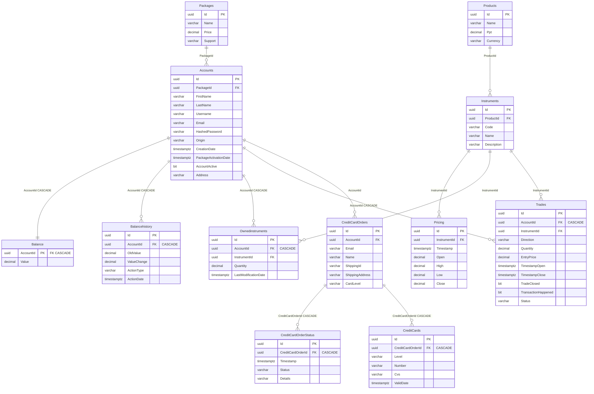

## Database diagram

```mermaid
erDiagram

    Packages {
        uuid    Id      PK
        varchar Name
        decimal Price
        varchar Support
    }

    Accounts {
        uuid        Id                    PK
        uuid        PackageId             FK
        varchar     FirstName
        varchar     LastName
        varchar     Username
        varchar     Email
        varchar     HashedPassword
        varchar     Origin
        timestamptz CreationDate
        timestamptz PackageActivationDate
        bit         AccountActive
        varchar     Address
    }

    Balance {
        uuid    AccountId   PK "FK CASCADE"
        decimal Value
    }

    Balancehistory {
        uuid        Id          PK
        uuid        AccountId   FK "CASCADE"
        decimal     OldValue
        decimal     ValueChange
        varchar     ActionType
        timestamptz ActionDate
    }

    Products {
        uuid    Id       PK
        varchar Name
        decimal Ppt
        varchar Currency
    }

    Instruments {
        uuid    Id          PK
        uuid    ProductId   FK
        varchar Code
        varchar Name
        varchar Description
    }

    Pricing {
        uuid        Id           PK
        uuid        InstrumentId FK
        timestamptz Timestamp
        decimal     Open
        decimal     High
        decimal     Low
        decimal     Close
    }

    Ownedinstruments {
        uuid        Id                   PK
        uuid        AccountId            FK "CASCADE"
        uuid        InstrumentId         FK
        decimal     Quantity
        timestamptz LastModificationDate
    }

    Trades {
        uuid        Id                  PK
        uuid        AccountId           FK "CASCADE"
        uuid        InstrumentId        FK
        varchar     Direction
        decimal     Quantity
        decimal     EntryPrice
        timestamptz TimestampOpen
        timestamptz TimestampClose
        bit         TradeClosed
        bit         TransactionHappened
        varchar     Status
    }

    CreditCardOrders {
        uuid    Id              PK
        uuid    AccountId       FK
        varchar Email
        varchar Name
        varchar ShippingId
        varchar ShippingAddress
        varchar CardLevel
    }

    CreditCardOrderStatus {
        uuid        Id                PK
        uuid        CreditCardOrderId FK "CASCADE"
        timestamptz Timestamp
        varchar     Status
        varchar     Details
    }

    CreditCards {
        uuid        Id                PK
        uuid        CreditCardOrderId FK "CASCADE"
        varchar     Level
        varchar     Number
        varchar     Cvs
        timestamptz ValidDate
    }

    %% ── Relationships ─────────────────────────────────────────────────────
    Packages          ||--o{ Accounts             : "PackageId"
    Accounts          ||--||  Balance              : "AccountId CASCADE"
    Accounts          ||--o{ Balancehistory        : "AccountId CASCADE"
    Accounts          ||--o{ Ownedinstruments      : "AccountId CASCADE"
    Accounts          ||--o{ Trades                : "AccountId CASCADE"
    Accounts          ||--o{ CreditCardOrders      : "AccountId"
    Products          ||--o{ Instruments           : "ProductId"
    Instruments       ||--o{ Pricing               : "InstrumentId"
    Instruments       ||--o{ Ownedinstruments      : "InstrumentId"
    Instruments       ||--o{ Trades                : "InstrumentId"
    CreditCardOrders  ||--o{ CreditCardOrderStatus : "CreditCardOrderId CASCADE"
    CreditCardOrders  ||--o{ CreditCards           : "CreditCardOrderId CASCADE"
```